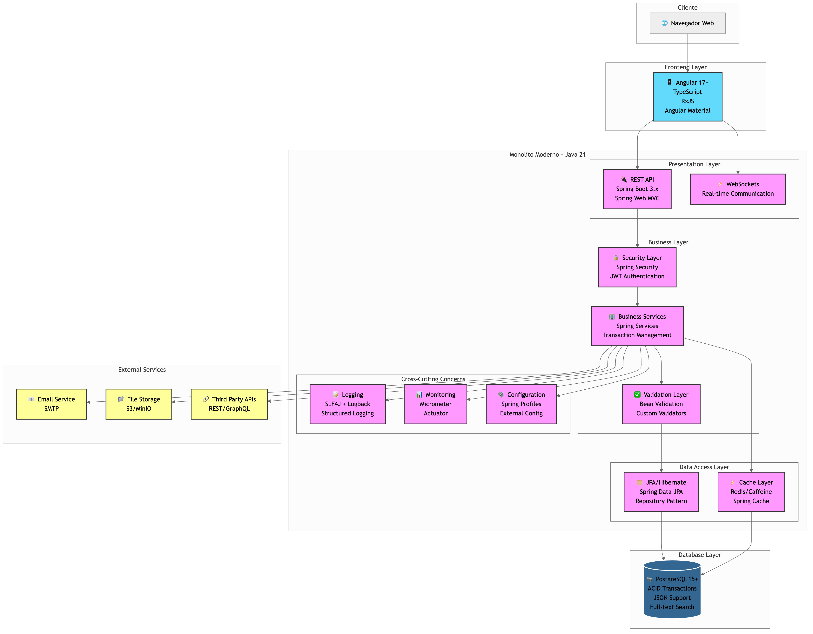
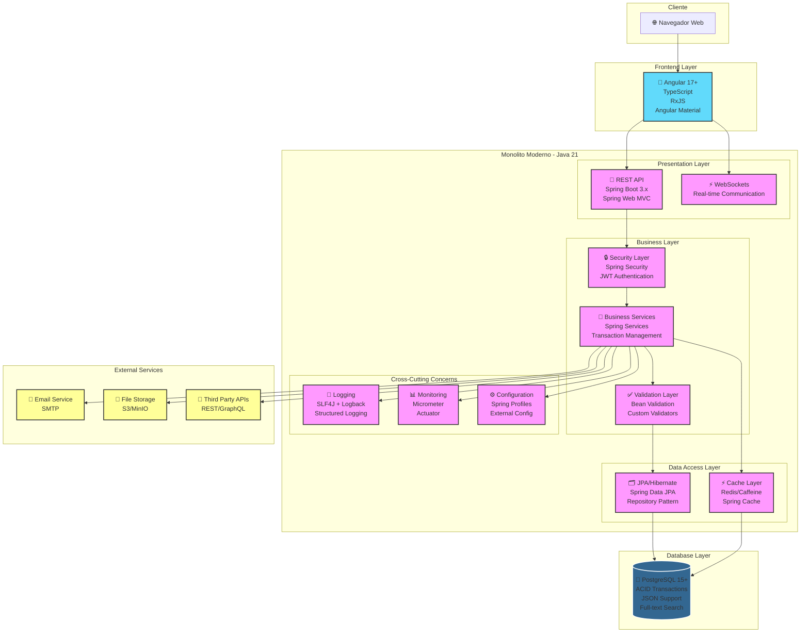
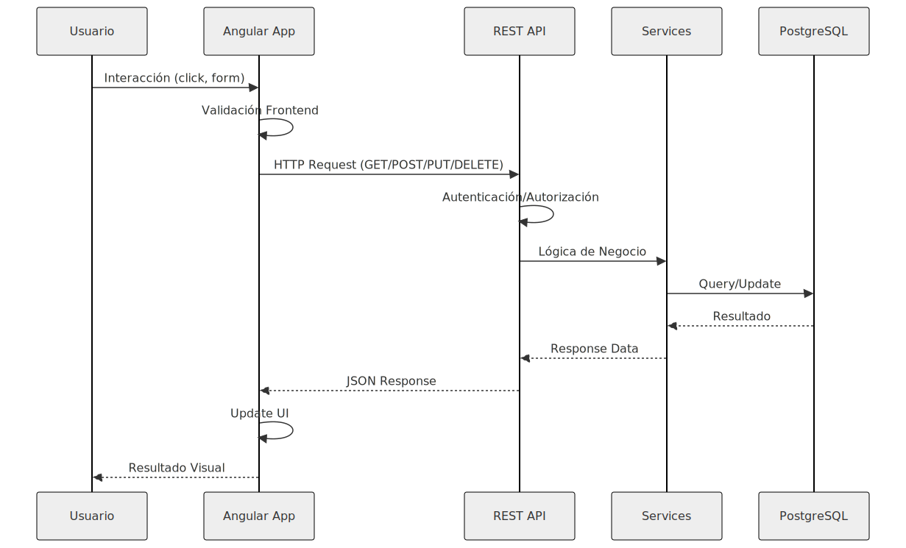
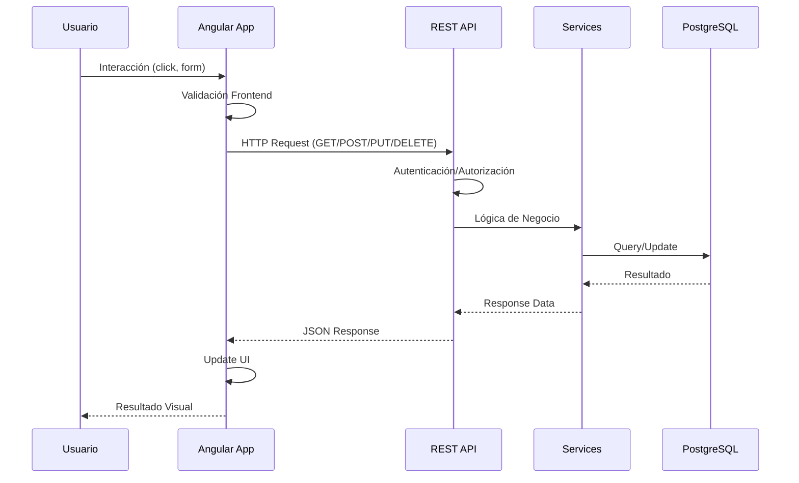

# Arquitectura de Monolito Moderno

## Diagrama de Arquitectura

### 🎯 **Imagen Vectorial SVG** (Calidad perfecta para zoom)

> **💡 Tip**: Haz clic derecho en la imagen SVG y selecciona "Abrir imagen en nueva pestaña" para verla en tamaño completo y hacer zoom sin perder calidad.

### 📸 **Imagen PNG de Alta Resolución** (Para presentaciones)

### 📋 **Código Fuente Mermaid**

## Componentes Tecnológicos

### Frontend - Angular
- **Framework**: Angular 17+ con TypeScript
- **Estado**: NgRx o Akita para manejo de estado
- **UI**: Angular Material o PrimeNG
- **HTTP**: HttpClient con interceptors
- **Autenticación**: JWT tokens

### Backend - Java 21 Monolito
- **Framework**: Spring Boot 3.x
- **Seguridad**: Spring Security con JWT
- **Persistencia**: Spring Data JPA + Hibernate
- **Cache**: Redis o Caffeine
- **Monitoreo**: Spring Actuator + Micrometer

### Base de Datos
- **PostgreSQL 15+**: Base de datos principal
- **Características**: JSONB, Full-text search, Transacciones ACID

## Flujo de Datos

### 🎯 **Diagrama de Secuencia - Imagen Vectorial SVG**

### 📋 **Código Fuente del Diagrama de Secuencia**

## Patrones de Diseño Utilizados

- **MVC**: Separación clara de responsabilidades
- **Repository Pattern**: Abstracción de acceso a datos
- **Service Layer**: Lógica de negocio centralizada
- **DTO Pattern**: Transferencia de datos entre capas
- **Builder Pattern**: Construcción de objetos complejos
- **Observer Pattern**: Eventos y notificaciones